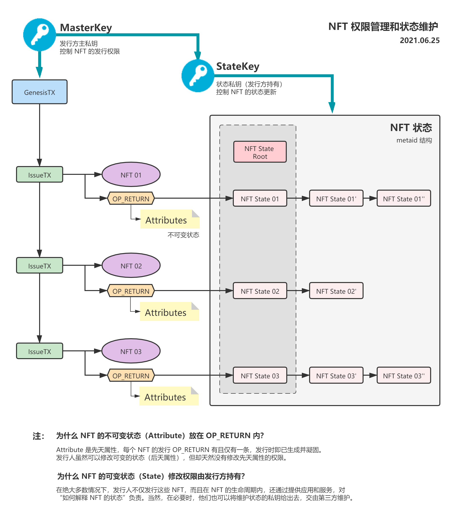

## schedule

Time: 6.24, 20:00-20:50

1. TokenSwap 测试版遇到的问题和解决分享 (10min)
2. nft/ft swap 这块，可讨论下如何进行~ @cc @Kervin (10min)
3. 喂价 oracle 的相关情况分享，更细致的细节需求可讨论下 @王福强 @aaron67 (10min)
4. 区块分析扫描优化方案分享和签名器访问延迟的进一步优化 @蒋杰 (10min)
5. 近期需求和后续计划  (10min)
6. 历史记录 添加交易接受者address
7. token/bsv p2p交易

## records

### 1. TokenSwap 测试版遇到的问题和解决分享

- 祖孙限制 (某些交易手续费低于 0.5) 可能是被攻击的点 (恶意给低)
- 需要保证 Sensible Query 和 MetaSV 的连通性
- 优化后，目前 1-2s 就可以完成签名到交易发送的全过程 (简单优化的已经都处理了)
- 多个用户请求各自发，不会串行化，失败重试即可

### 2. nft/ft swap

- 下周 cc 改合约，耀欢改下 sdk 的对应实现
- 跨网站的 nft 协议
- 理想情况下 7 月初就可以用新版 nft 了
- (冯总) 考虑 nft 多市场互通 (7 月份)

### 3. 喂价 oracle

- 王福强：目前价格只是从火币取的？(是的) 需要从多个源聚合
- 目前 chainlink 可以在合约内直接取价格，我们还不行
- 之前返回的 (已经过期的) 时间戳一直可用，解决方案是带上合约要用的 outpoint

### 其他

- 找 xiaohui review 合约代码
- dust 问题 (目前 mAPI 已经可以， p2p 不行) 结论：空投用 mAPI，后续转账 p2p
- (蒋杰) 测试网已经可以在蒋杰这边直接打包了 (测试网矿机)
- (王宇) 需求：希望 query 服务添加单个 nft 的历史记录 
- (王福强) RateSV (问下旺仔)

----------

- 2021-06-26 补了NFT 权限控制和状态管理的高清示意图 (看高清需要先另存):

